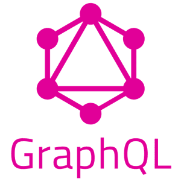
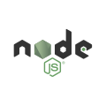
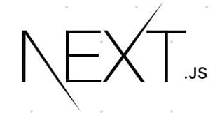
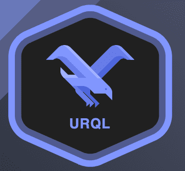
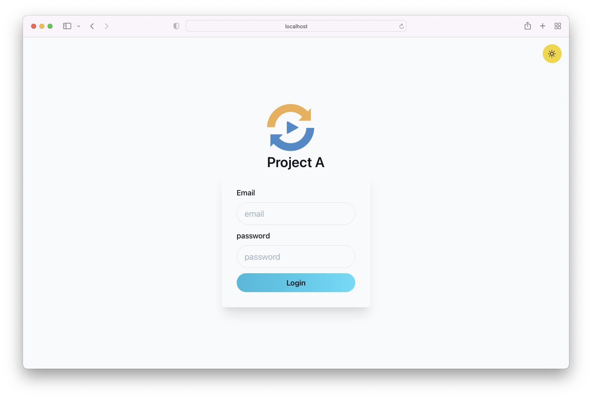
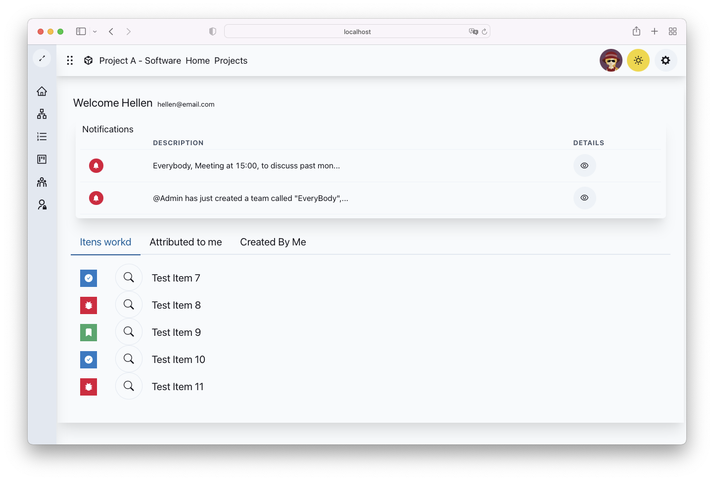
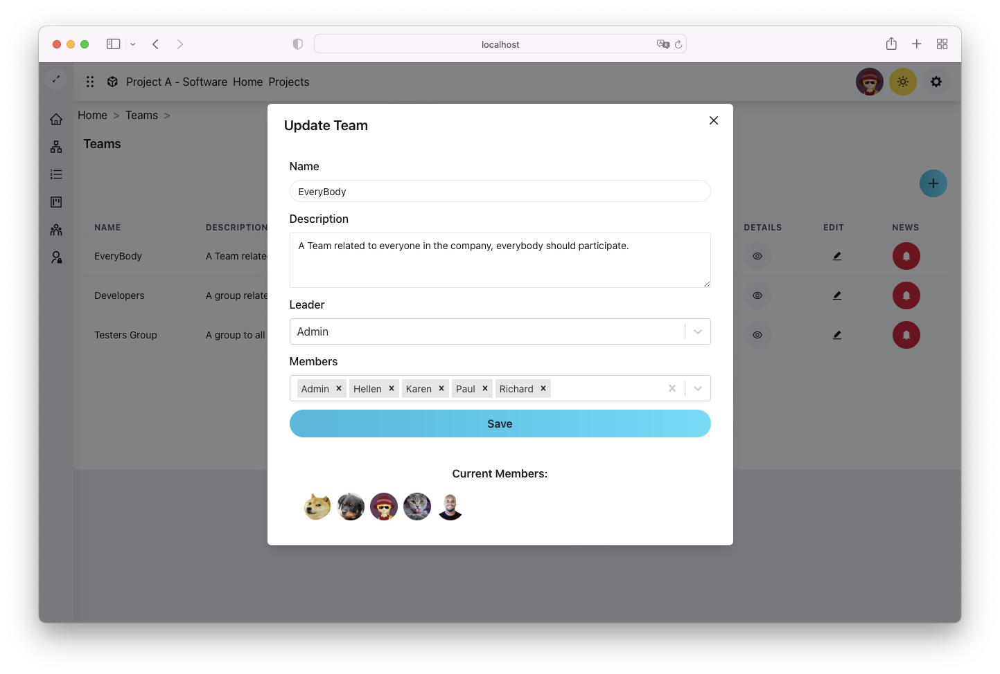
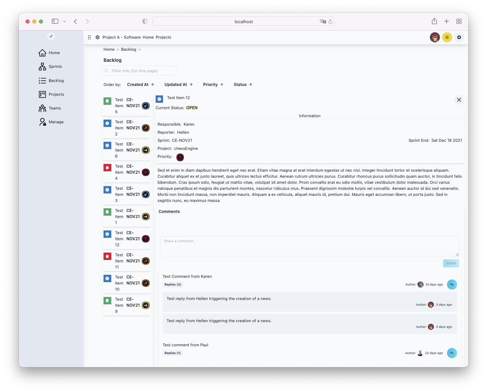
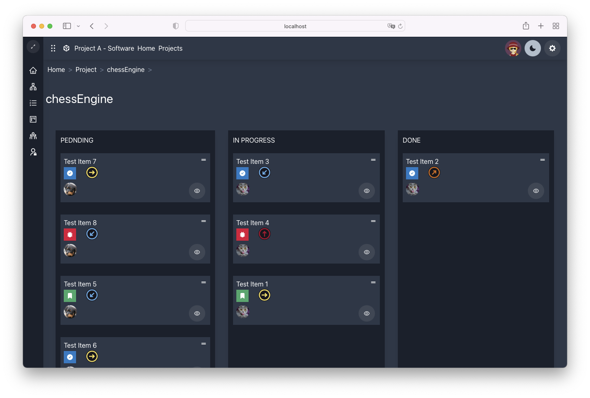
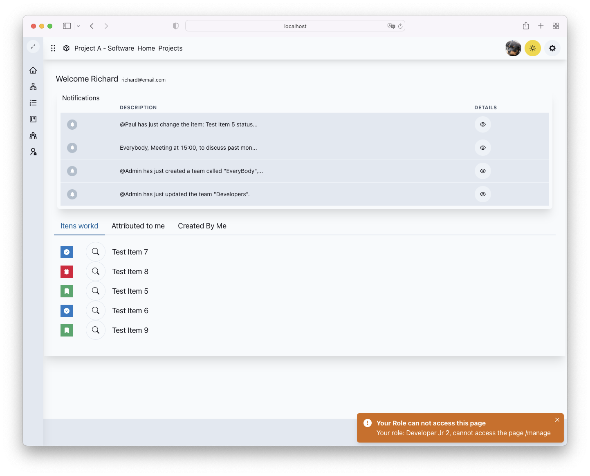

# Project A

Project A is a website based on JIRA, in which a team of users, each on with his own role, like developers, managers and testers work together to make software projects.

## This is a Portfolio Project...

This project is a portfolio project, with the purpose of putting into practice the learning of building apis using graphql and clients using react, simulating the maximum that can be required of a developer using these technologies.

## Technologies used.

## Used Packages Details:

### Backend:

**Node, Express, Apollo Server, GraphQL, PostgreSQL, MikroORM as ORM, graphql-upload and JsonWebToken. (TypeScript)**

### Front:

**NextJs, Chakra UI, Urql, React Icons, React DnD, Formik, React Select and GraphQL Code Generator. (TypeScript)**

## Tutorials that helped me make this project:

-   [Main Stack Setup (Ben Awad Youtube)](https://www.youtube.com/watch?v=I6ypD7qv3Z8)
-   [React Drag and Drop Tutorial (Besides Docs)](https://medium.com/nmc-techblog/easy-drag-and-drop-in-react-22778b30ba37)
-   [Urql React](https://formidable.com/open-source/urql/docs/api/urql/)
-   [File Upload with Urql](https://seraphyc.medium.com/file-upload-with-urql-and-apollo-server-3483b8ec0cc4)

# Screenshots

