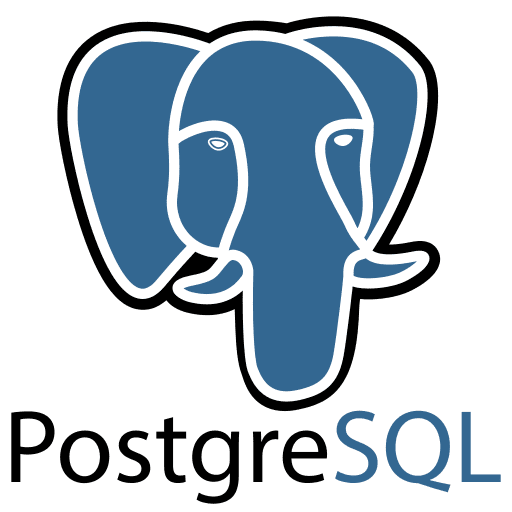

# Project A

<p align="center">

</p>
<p>
Project A is a website based on JIRA, in which a team of users, each on with his own role, like developers, managers and testers work together to make software projects.
</p>
<br>

## This is a Portfolio Project...

<p>
This project is a portfolio project, with the purpose of putting into practice the learning of building apis using graphql and clients using react, simulating the maximum that can be required of a developer using these technologies.
</p>
<br>

## Technologies used.

<br>

<p>





</p>
<br>

## Used Packages Details:

<br>

### Backend:

**Node, Express, Apollo Server, GraphQL, PostgreSQL, MikroORM as ORM, graphql-upload and JsonWebToken. (TypeScript)**
<br>

### Front:

**NextJs, Chakra UI, Urql, React Icons, React DnD, Formik, React Select and GraphQL Code Generator. (TypeScript)**
<br>

## Tutorials that helped me make this project:

-   [Main Stack Setup (Ben Awad Youtube)](https://www.youtube.com/watch?v=I6ypD7qv3Z8)
-   [React Drag and Drop Tutorial (Besides Docs)](https://medium.com/nmc-techblog/easy-drag-and-drop-in-react-22778b30ba37)
-   [Urql React](https://formidable.com/open-source/urql/docs/api/urql/)
-   [File Upload with Urql](https://seraphyc.medium.com/file-upload-with-urql-and-apollo-server-3483b8ec0cc4)

# Running it Local:

<p>You will need postgres running and with a database name attached to your .env file name</p>

### Your .env File should be like this:

```
ACCESS_TOKEN_SECRET=yourSecretRefresh
REFRESH_TOKEN_SECRET=yourSecretAccess
DEV_FRONT_URL=http://localhost:3000
DB_NAME=your_database_project_name
DB_USER=postgres
DB_PASSWORD=postgres
NODE_ENV=development

```

<p>
this ".env" file must be placed on : (project_a/server/)
</p>

```
yarn install (server/ and web/web)
```

<p>
After this, use the ORM to generate the relations needed: (/server)
</p>

```
 npx mikro-orm migration:up
```

<p>
After install the dependencies and .env correctly placed, the command above should create all the relations, make sure to log in into your postgres user and see the new relations use: "\dt", also check the terminal output. 
Run the watch command to keeping recompiling the typescript, and in another terminal, dev command to execute the index.js generated
in dist/ folder
</p>

/server :

```
yarn watch and yarn dev
```

After this your playground should be running at localhost:4001/graphql.

/web/web/

```
yarn dev
```

localhost:3000

# Screenshots


